

 

### `// SELECTED PROJECTS`

* ⚡ **[Glance](https://github.com/reva-hattekar/Glance)** — Smart-glasses ML detection + ESP32 BLE Time-of-Flight laser node
* 🤖 **Companion Robot** — Interactive physical desk robot with custom embedded circuitry & expressive OLED keyframes
* 🪞 **Smart Mirror** — Raspberry Pi & Linux vision display *(Top 20 at IIT Bombay Techfest 2020)*
* 🗺️ **[TARA](https://github.com/reva-hattekar/TARA)** — Dynamic urban safety engine & spatial dark-zone infrastructure triage

 

  <code>reva@workspace:~$ building · experimenting · learning</code>

